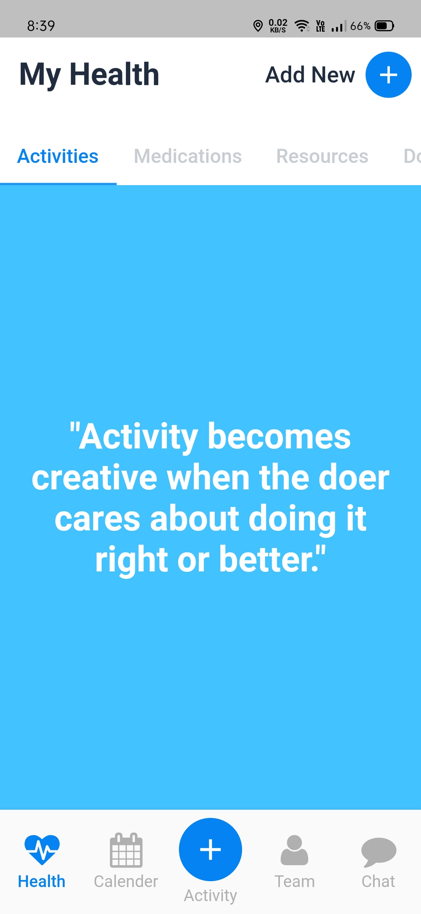
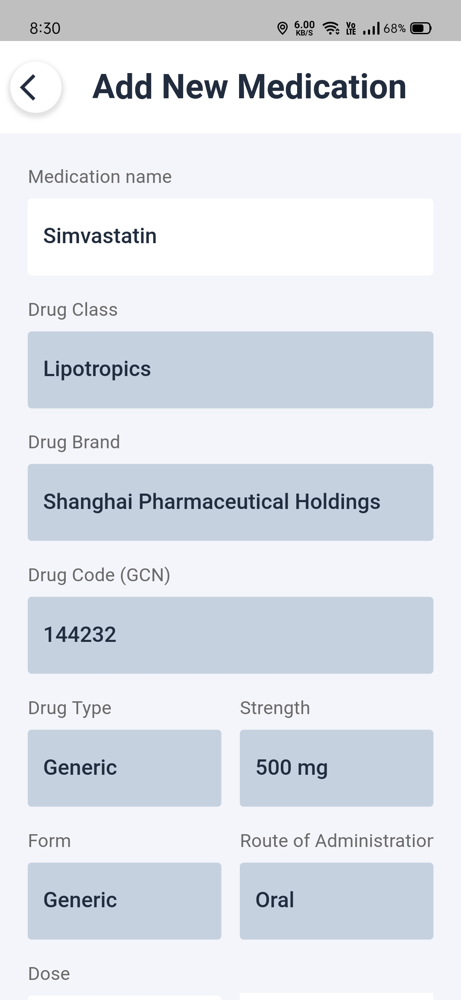
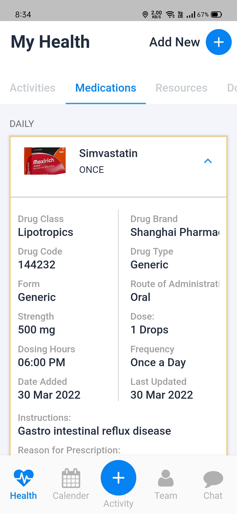
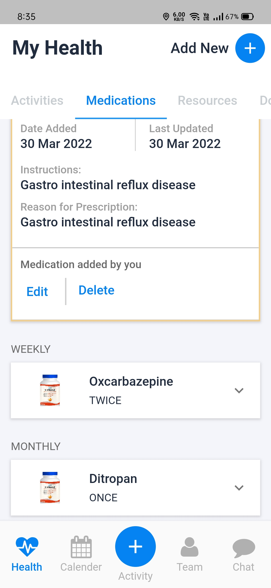
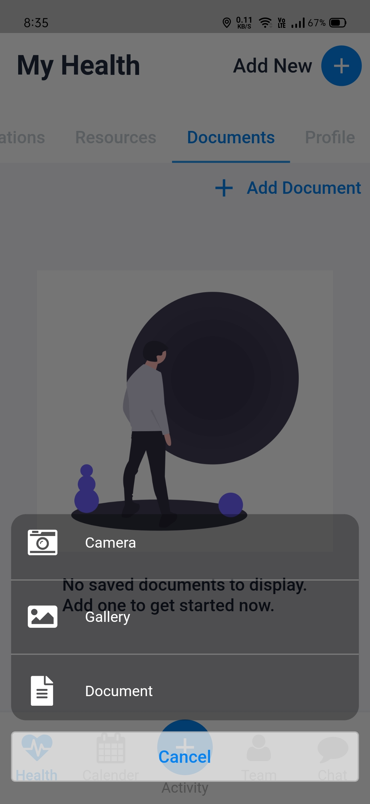
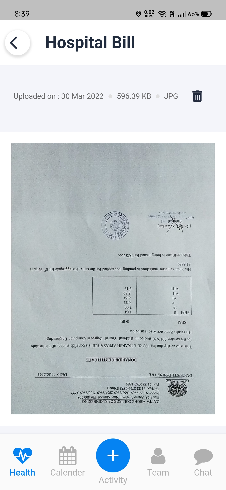
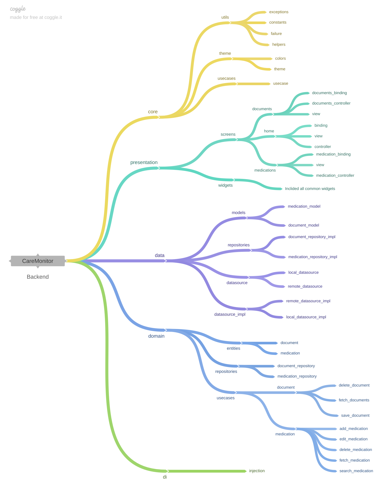

# CareMonitor

A flutter application for monitroing health remotely.

[![Watch the video]](https://drive.google.com/file/d/13PR5eAa7k2wE-sb8qAu4u00KvXd6tgGg/view?usp=sharing)

#### Features: 

1. Fetch/Add/Edit/Delete medications.
2. Search medications.
3. Add prescriptions.
4. View/delete prescriptions.

#### Approach: 

The project follows **MVVM architecture** with **GetX** as a StateManagement library. The UI is as reflective as possible with rich icons. Data is stored in local device with [GetStorage](https://pub.dev/packages/get_storage). 
Medication & Documents are stored locally but network calls can be implemented(code already written and commented). 

#### Project Structure:

Find directory structure below:

- **presentation/** : Presents appplication data to users with views and widgets. Included Controllers and bindings for views.
  
-  **domain/** : Defines usecases and repository contracts and stores entities with fields.
  
-  **data/** : Implements repository contracts to communicate usecases with outside world. Manages local and remote data sources for bringing/posting data outside application scope.
  
-  **di/** : Injects application dependencies for better dependency management and loose coupling.

#### Resources: 

* GetX package - https://pub.dev/packages/get

## Getting Started

- [Lab: Write your first Flutter app](https://flutter.dev/docs/get-started/codelab)
- [Cookbook: Useful Flutter samples](https://flutter.dev/docs/cookbook)

[online documentation](https://flutter.dev/docs)